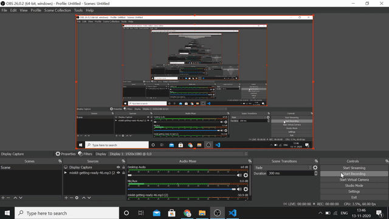

# FACEBOOK
MADE WITH REACT Js AND FIREBASE 

## WALK OVER THE PROJECT

## concepts used 
* React + React Hooks
* Firebase **Google Authentication [FULL LOGIN]**
* Firebase Hosting  Link - https://facebookclone-8a4b4.web.app/
* Material UI - A lib for CSS
* Flex Box  - Used to arrange items 
* React Context API -Redux Pattern to drill down the apps

In the project directory, you can run:

### `yarn start`

Runs the app in the development mode.\
Open [http://localhost:3000](http://localhost:3000) to view it in the browser.

The page will reload if you make edits.\
You will also see any lint errors in the console.

### `yarn test`

Launches the test runner in the interactive watch mode.\
See the section about [running tests](https://facebook.github.io/create-react-app/docs/running-tests) for more information.

